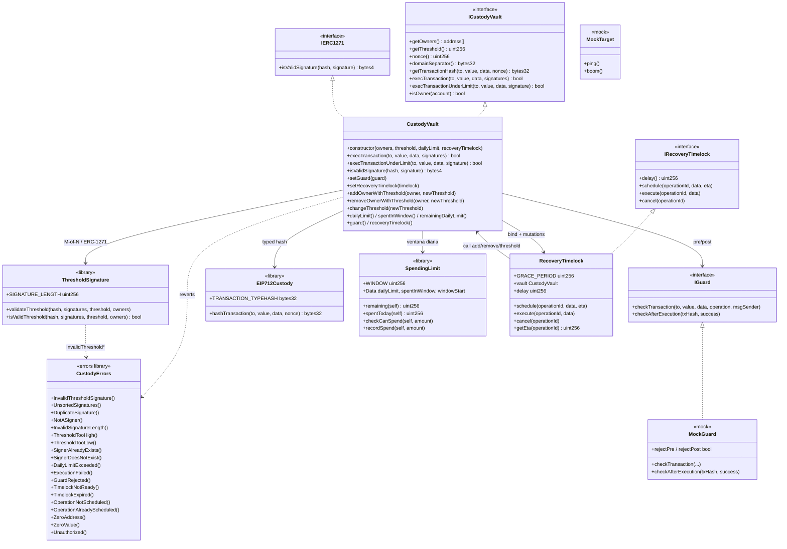

# Diagrama de clases — Institutional Custody, Multisig & MPC Integration

Vista estructural alineada a la implementación v1 (módulo 20).  
**Sync:** 2026-09-15 · Fases **BOOT → SOLV** ✅ · `forge test` → **69 PASS**.

> **Estándar de referencia:** vault multisig estilo Safe + verificación threshold Secp256k1 on-chain, ERC-1271, spending limits y recovery con timelock.  
> “MPC” = firmas off-chain (posiblemente vía MPC) **verificadas** on-chain como M-of-N ECDSA; no hay circuito MPC en el contrato.

## Diagrama (Mermaid)



## Responsabilidades

| Artefacto | Responsabilidad |
|-----------|-----------------|
| `CustodyVault` | Owners/threshold/nonce; exec quorum + under-limit; ERC-1271; guard; bind timelock |
| `ThresholdSignature` | ECDSA recover in-place + orden ascendente + unique owners ≥ M |
| `EIP712Custody` | Typehash `CustodyTransaction(to,value,data,nonce)` |
| `SpendingLimit` | Ventana rolling `1 days`; `remaining` / `recordSpend` |
| `IGuard` / `MockGuard` | Política pre/post (lab) |
| `RecoveryTimelock` | Delay + grace 14d; schedule/cancel solo vault; execute permissionless |
| `CustodyErrors` | Custom errors del módulo |
| `MockTarget` | Target de ejecución en tests |

## Modelo de permisos en ejecución

```
  execTransaction(to, value, data, signatures)
           │
           ▼
  ┌────────────────────┐
  │ Threshold M-of-N   │──fail──► InvalidThreshold* / Unsorted / Dup / NotASigner
  └─────────┬──────────┘
            │ ok
            ▼
  ┌────────────────────┐
  │ Guard pre (cached) │──fail──► GuardRejected
  └─────────┬──────────┘
            │ ok / sin guard
            ▼
  ┌────────────────────┐
  │ Effects: nonce++   │  (CEI)
  └─────────┬──────────┘
            ▼
  ┌────────────────────┐
  │ to.call{value}     │──fail──► ExecutionFailure + return false
  └─────────┬──────────┘
            │ (success o false)
            ▼
      Guard post (mismo guard cacheado)
      Emit Success / Failure
```

> Under-limit: 1 firma owner + `checkCanSpend(value)` + `recordSpend` en effects.  
> Quorum completo **bypassea** el daily cap.  
> Call fallido **no** revierte el outer (nonce/spend ya consumidos).

## Roles

| Rol | Mecanismo | Acciones |
|-----|-----------|----------|
| Owner / Signer | lista on-chain | Firmar EIP-712; under-limit con 1 firma |
| Relayer | cualquiera | `execTransaction` / under-limit / `timelock.execute` |
| Guard | `IGuard` vía multisig `setGuard` | Rechazar pre/post |
| Recovery timelock | bound una vez | Mutar owners/threshold tras delay |
| dApp | ERC-1271 | `isValidSignature` |

## Errores custom (implementados)

| Error | Uso |
|-------|-----|
| `InvalidThresholdSignature()` | Umbral / recover inválido |
| `UnsortedSignatures()` / `DuplicateSignature()` | Orden / dup |
| `NotASigner()` | Recover ∉ owners |
| `InvalidSignatureLength()` | Packed ≠ 65·N |
| `DailyLimitExceeded()` | Under-limit sin allowance |
| `GuardRejected()` | Guard pre/post falla |
| `TimelockNotReady()` / `TimelockExpired()` | Execute fuera de ventana |
| `OperationNotScheduled()` / `AlreadyScheduled()` | Schedule/cancel/execute |
| `ExecutionFailed()` | Timelock call al vault falló |
| `Unauthorized()` | Self-call / timelock / data mismatch |
| `ThresholdTooHigh/Low` / `SignerAlreadyExists/DoesNotExist` | Mutaciones custody |
| `ZeroAddress()` / `ZeroValue()` | Inputs inválidos |
