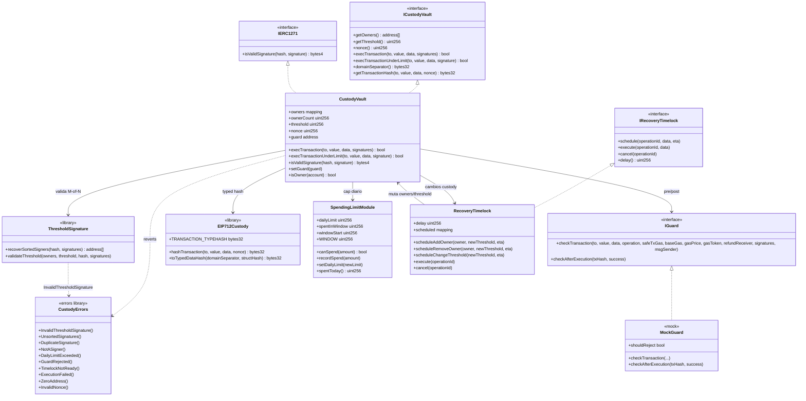

# Diagrama de clases — Institutional Custody, Multisig & MPC Integration

Vista estructural del **diseño objetivo** (módulo 20).  
**Sync:** 2026-09-15 · Fases **BOOT → SOLV** ⏳ · código aún no iniciado.

> **Estándar de referencia:** vault multisig estilo Safe + verificación threshold Secp256k1 on-chain, ERC-1271, spending limits y recovery con timelock.  
> “MPC” en este módulo = firmas generadas off-chain (posiblemente vía MPC) y **verificadas** on-chain como M-of-N ECDSA; no hay circuito MPC en el contrato.

## Diagrama (Mermaid)



## Responsabilidades

| Artefacto | Responsabilidad |
|-----------|-----------------|
| `CustodyVault` | Estado de owners/threshold; ejecución; ERC-1271; wiring de guard y límites |
| `ThresholdSignature` | ECDSA recover + orden estricto + conteo ≥ M |
| `EIP712Custody` | Domain + typehash de transacciones del vault |
| `SpendingLimitModule` | Ventana temporal y acumulado de gasto |
| `IGuard` / `MockGuard` | Política pre/post execution |
| `RecoveryTimelock` | Delay para add/remove signer y change threshold |
| `CustodyErrors` | Custom errors del módulo |

## Modelo de permisos en ejecución

```
  execTransaction(to, value, data, signatures)
           │
           ▼
  ┌────────────────────┐
  │ Guard pre-check?   │──fail──► GuardRejected
  └─────────┬──────────┘
            │ ok / sin guard
            ▼
  ┌────────────────────┐
  │ Hash EIP-712+nonce │
  └─────────┬──────────┘
            ▼
  ┌────────────────────┐
  │ Threshold M-of-N   │──fail──► InvalidThresholdSignature
  │ (sorted, unique)   │         Unsorted / Duplicate / NotASigner
  └─────────┬──────────┘
            │ ok
            ▼
  ┌────────────────────┐
  │ Effects: nonce++   │  (CEI)
  │ record spend si aplica
  └─────────┬──────────┘
            ▼
  ┌────────────────────┐
  │ Interaction: call  │──fail──► ExecutionFailed
  └─────────┬──────────┘
            │ ok
            ▼
      Guard post-check
      Emit ExecutionSuccess
```

## Roles

| Rol | Mecanismo | Acciones |
|-----|-----------|----------|
| Owner / Signer | lista on-chain | Firmar txs EIP-712; path bajo límite (según diseño SPEND) |
| Executor | cualquiera (relayer) | Enviar `execTransaction` con firmas |
| Guard | contrato `IGuard` | Rechazar/auditar pre/post |
| Recovery admin | owners vía timelock | Schedule/execute cambios de custody |
| dApp | ERC-1271 | `isValidSignature` contra el vault |

## Errores custom (diseño)

| Error | Uso |
|-------|-----|
| `InvalidThresholdSignature()` | Umbral no alcanzado / firma inválida |
| `UnsortedSignatures()` | Array no ordenado por address |
| `DuplicateSignature()` | Misma address recuperada dos veces |
| `NotASigner()` | Recover ∉ owners |
| `DailyLimitExceeded()` | Path rápido supera cap de ventana |
| `GuardRejected()` | Guard pre/post falla |
| `TimelockNotReady()` | Execute antes de `eta` |
| `ExecutionFailed()` | `.call` externo falló |
| `InvalidNonce()` | Hash con nonce incorrecto (si se valida off-hash) |
