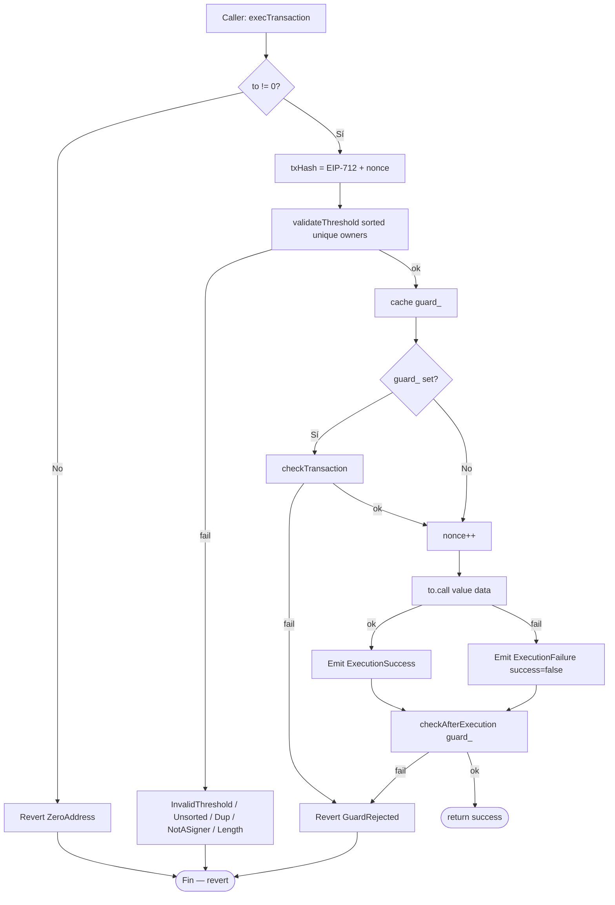
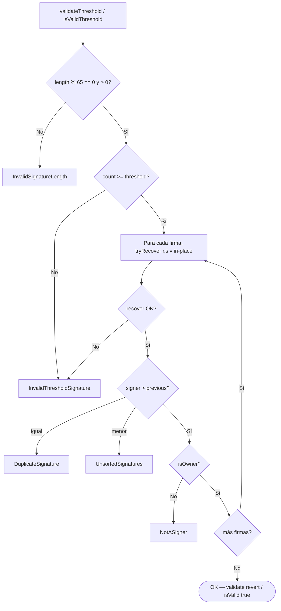
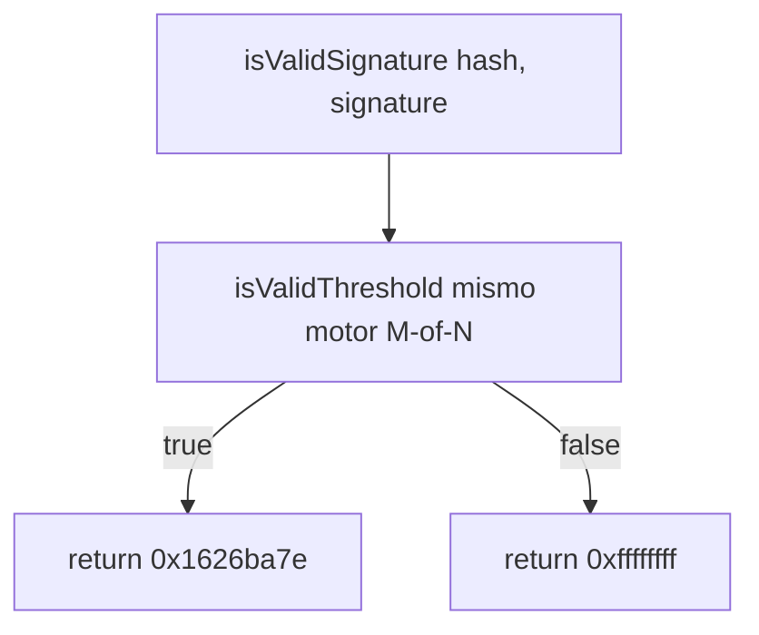
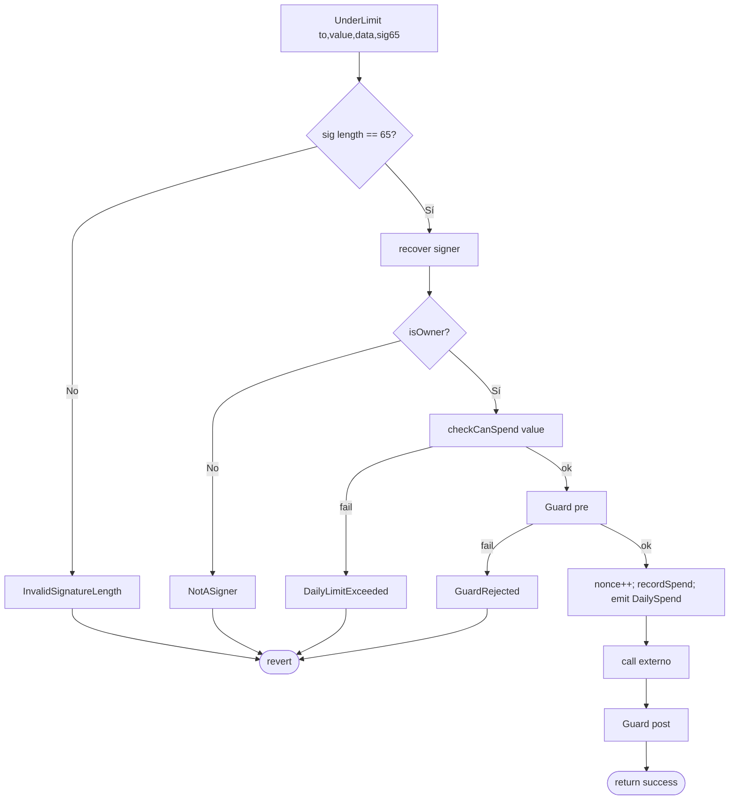
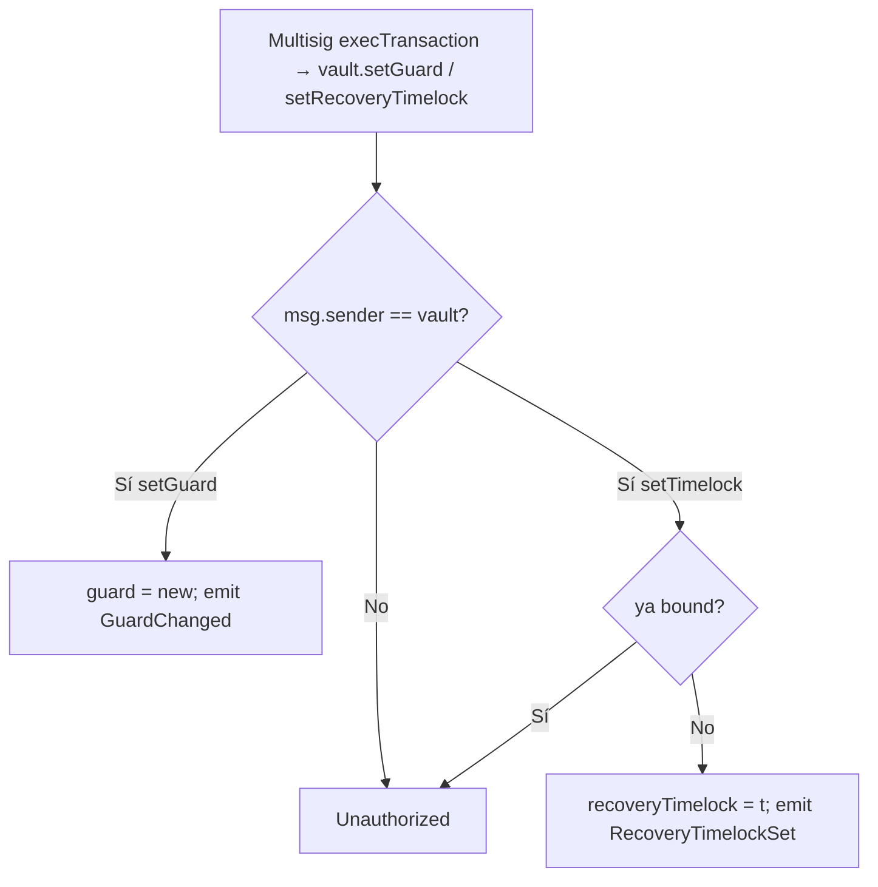
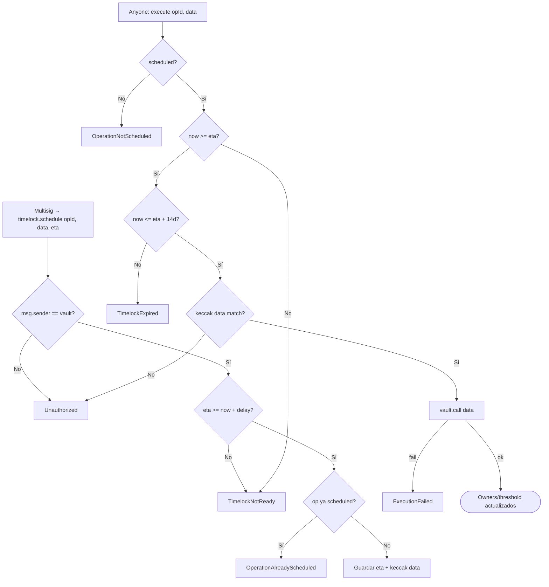

# Diagrama de flujo — Threshold, ERC-1271, spending, guards y recovery

Flujos de decisión internos del protocolo de custodia (módulo 20, **v1 implementado**).  
**Sync:** 2026-09-15 · Fases **BOOT → SOLV** ✅ · 69 PASS.

## 1. execTransaction (quorum M-of-N)

> Guard capturado **antes** del call: un `setGuard` en el mismo tx no afecta el post-check.

---

## 2. Validación threshold (detalle)

> `execTransaction` usa `validateThreshold` (revert). ERC-1271 usa `isValidThreshold` (bool).

---

## 3. ERC-1271 isValidSignature

> No revierte en el path ERC-1271 (compatibilidad dApp).

---

## 4. Daily spending — execTransactionUnderLimit

> Solo `value` (ETH) cuenta al cap. `value == 0` no consume allowance. Quorum completo bypassea el cap.

---

## 5. setGuard / setRecoveryTimelock

---

## 6. Recovery Timelock — cambio de signers / threshold

> `data` típico: `addOwnerWithThreshold` / `removeOwnerWithThreshold` / `changeThreshold`.  
> Mutaciones del vault solo aceptan `msg.sender == recoveryTimelock`.
