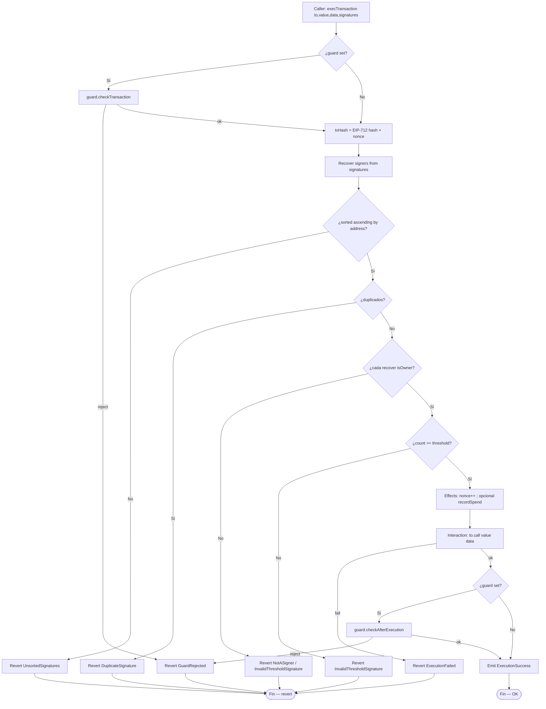
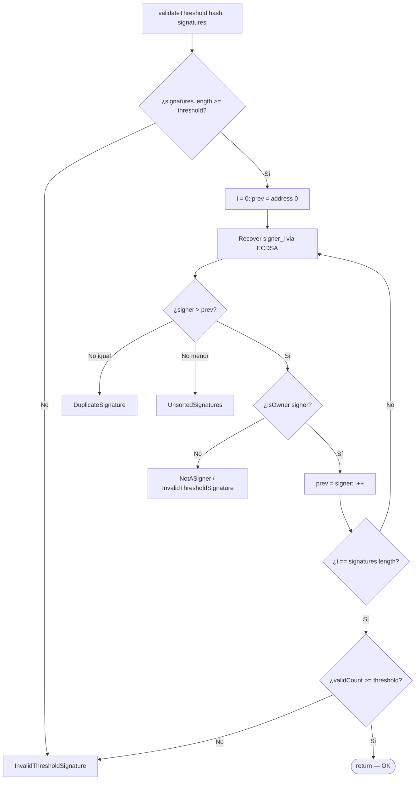
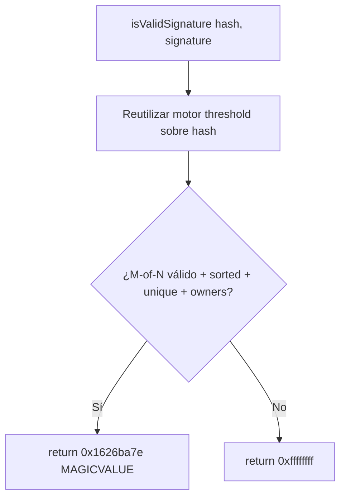
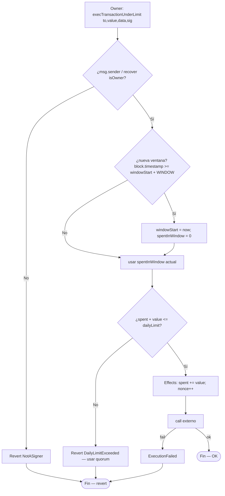
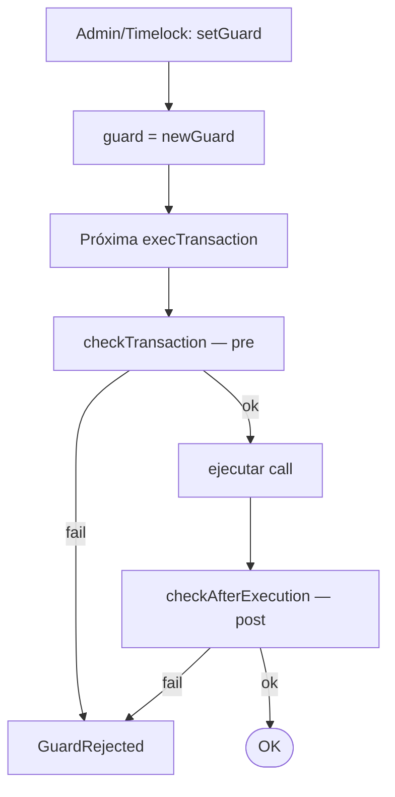
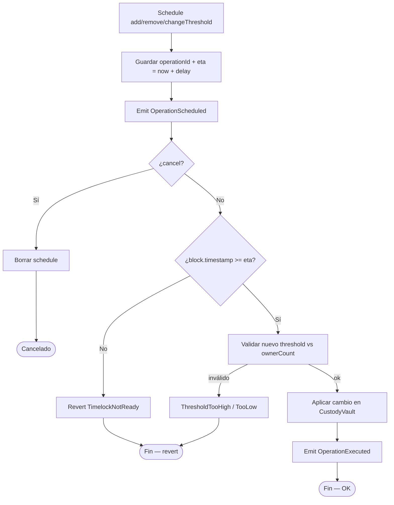

# Diagrama de flujo — Threshold, ERC-1271, spending, guards y recovery

Flujos de decisión internos del protocolo de custodia (módulo 20, **diseño objetivo**).  
**Sync:** 2026-09-15 · Fases **BOOT → SOLV** ⏳.

## 1. execTransaction (quorum M-of-N)

> CEI: validar firmas → actualizar nonce/spent → call externo → post-guard.

---

## 2. Validación threshold (detalle)

---

## 3. ERC-1271 isValidSignature

> Diseño provisional: no revertir en el path ERC-1271 (compatibilidad con consumidores que esperan magic value).  
> Se confirma en Fase ERC1271.

---

## 4. Daily spending — path under limit

> El fuzz de Fase SPEND/SOLV debe cruzar fronteras de `WINDOW` (p. ej. 1 día) sin permitir bypass.

---

## 5. Guard lifecycle

---

## 6. Recovery Timelock — cambio de signers / threshold

