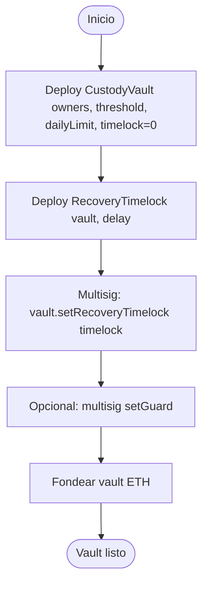
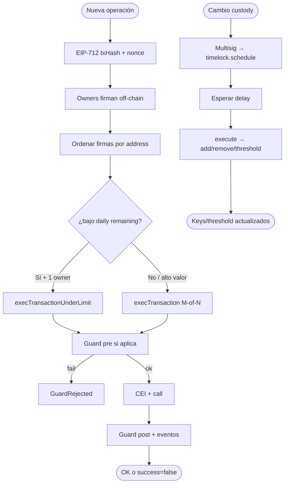
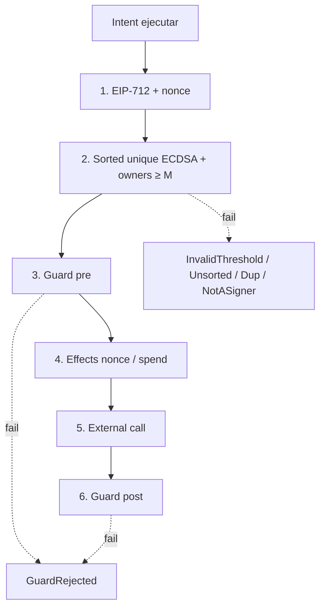
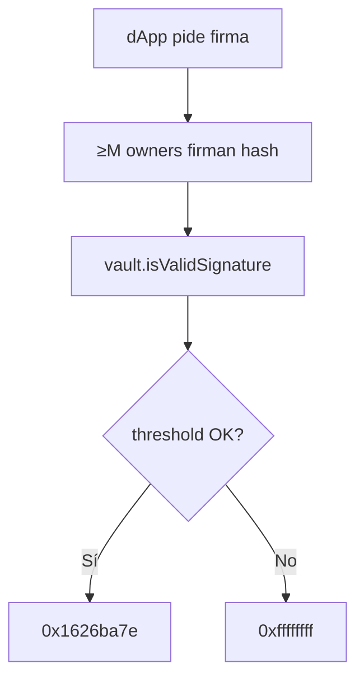
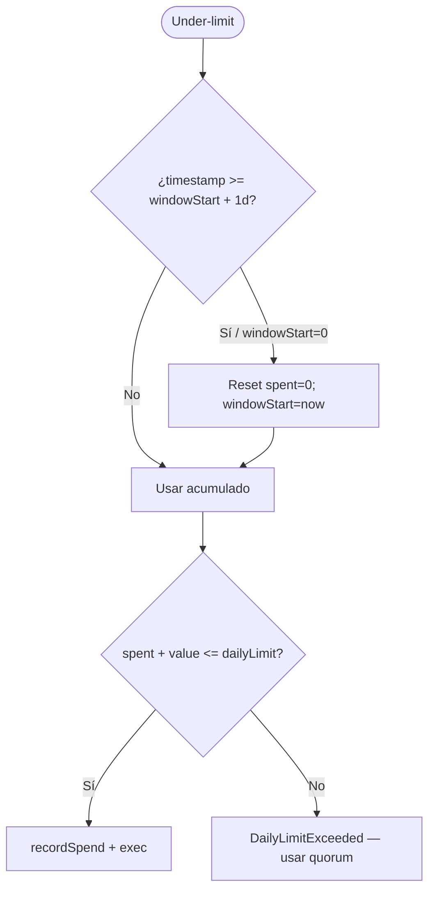
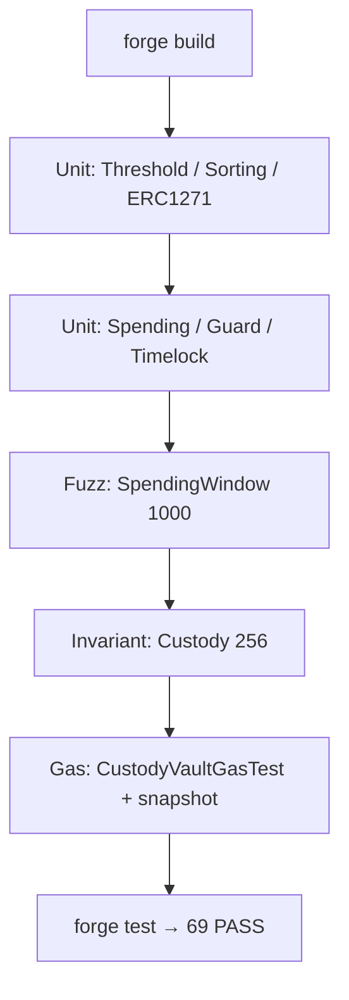

# Flujograma — Ciclo completo Institutional Custody & Multisig

Flujo extremo a extremo (módulo 20, **v1 implementado**).  
**Sync:** 2026-09-15 · Fases **BOOT → SOLV** ✅ · 69 PASS.

## Actores

| Actor | Rol |
|-------|-----|
| Institución / Deployer | Deploy vault + timelock; owners iniciales |
| Owners (N) | Firman off-chain (EOA o shares MPC → ECDSA) |
| Relayer | Publica `execTransaction` / under-limit / `timelock.execute` |
| Operador under-limit | Owner con 1 firma bajo daily cap |
| Guard | Política pre/post (opcional) |
| dApp / DeFi | `isValidSignature` (ERC-1271) |
| CI / Foundry | Unit, fuzz, invariantes, gas, SWC |

---

## Flujograma — Deploy y wiring (v1)

> Script: `script/Deploy.s.sol` (despliega vault + timelock; bind manual vía multisig).  
> Env: `.env.example` (`OWNER_1..3`, `THRESHOLD`, `DAILY_LIMIT`, `TIMELOCK_DELAY`).

---

## Flujograma principal — Sign → Execute → Limit → Recovery

---

## Flujograma — Capas de defensa

---

## Flujograma — ERC-1271 (dApp)

---

## Flujograma — Ventana spending

---

## Flujograma — Tooling Foundry (lab)

---

## Relación con otros docs

| Documento | Contenido |
|-----------|-----------|
| [diagrama-de-clases.md](./diagrama-de-clases.md) | Contratos, interfaces, librerías (API real) |
| [diagrama-de-flujo.md](./diagrama-de-flujo.md) | Decisiones internas por función |
| [planificacion.md](./planificacion.md) | Fases BOOT→SOLV cerradas |
| [SWC-AUDIT.md](./SWC-AUDIT.md) | Matriz SWC-100–136 |
| [GAS.md](./GAS.md) | Baseline gas |
