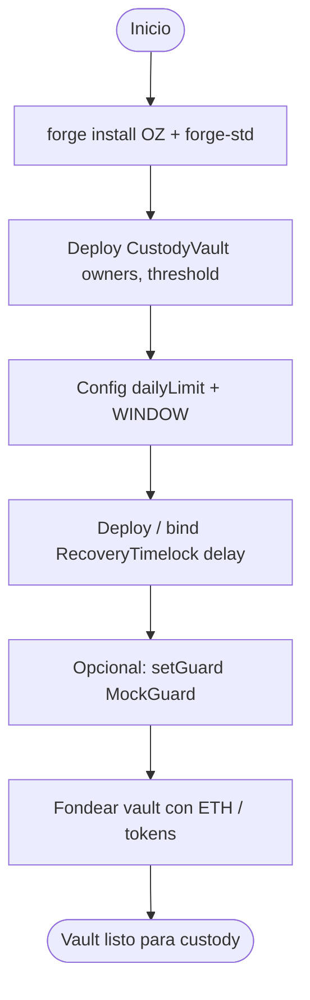
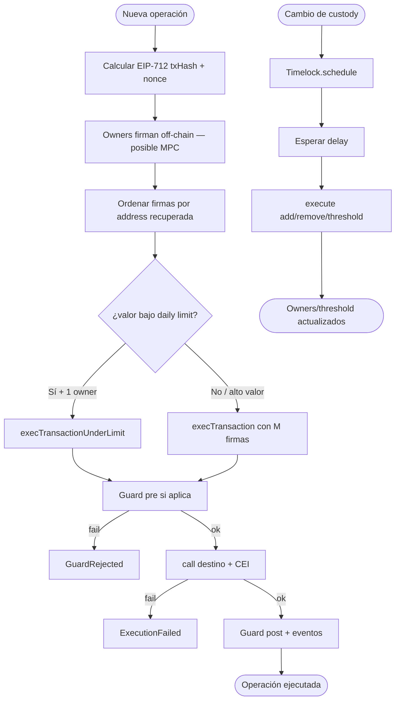
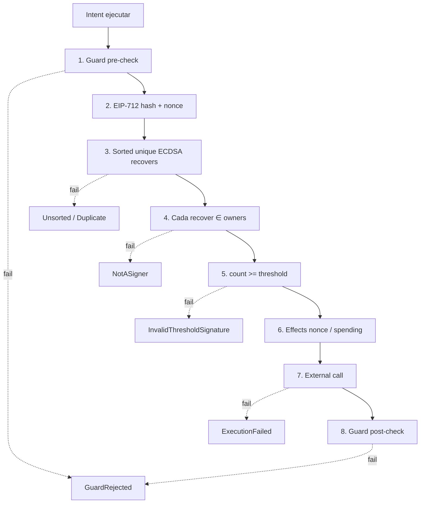
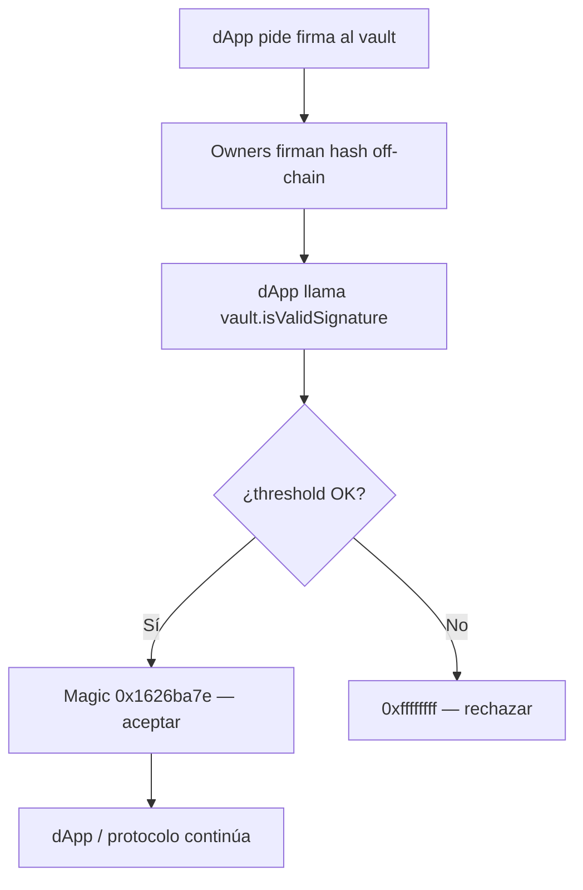
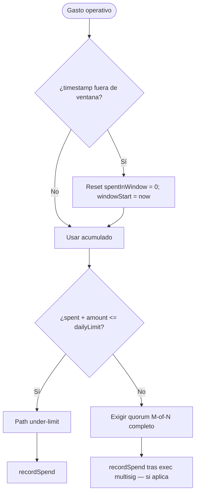
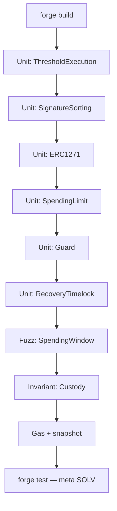

# Flujograma — Ciclo completo Institutional Custody & Multisig

Flujo extremo a extremo (módulo 20, **diseño objetivo**).  
**Sync:** 2026-09-15 · Fases **BOOT → SOLV** ⏳.

## Actores

| Actor | Rol |
|-------|-----|
| Institución / Admin | Deploy; configura owners, threshold, daily limit, delay |
| Owners (N) | Firman off-chain (EOA o shares MPC → ECDSA) |
| Relayer / Executor | Envía `execTransaction` on-chain con el payload de firmas |
| Operador under-limit | Owner que ejecuta txs bajo el cap diario |
| Guard | Política pre/post (deny lists, amount caps extra, etc.) |
| dApp / DeFi | Llama `isValidSignature` (ERC-1271) |
| Recovery scheduler | Agenda cambios de custody vía Timelock |
| CI / Foundry | Unit, fuzz spending, invariantes, gas, SWC |

---

## Flujograma — Deploy y wiring (v1)

> Script objetivo: `script/Deploy.s.sol`. Env: `.env.example` (`OWNERS`, `THRESHOLD`, `DAILY_LIMIT`, `TIMELOCK_DELAY`).

---

## Flujograma principal — Propose → Sign → Execute → Limit → Recovery

---

## Flujograma — Capas de defensa en ejecución

---

## Flujograma — Integración ERC-1271 (dApp)

---

## Flujograma — Ventana de spending diario

---

## Flujograma — Tooling Foundry (lab)

---

## Relación con otros docs

| Documento | Contenido |
|-----------|-----------|
| [diagrama-de-clases.md](./diagrama-de-clases.md) | Contratos, interfaces, librerías (diseño) |
| [diagrama-de-flujo.md](./diagrama-de-flujo.md) | Decisiones internas por función |
| [planificacion.md](./planificacion.md) | Fases BOOT→SOLV y autorización |
